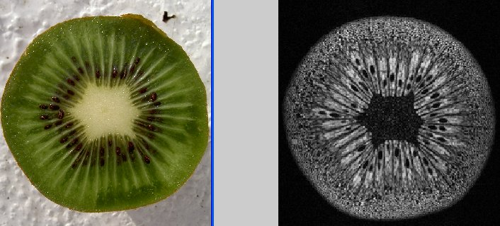

# In Vivo Imaging and Physiological Modelling - BMED 360 Spring 2020

## Midterm project:

### The KIWI fruit seed segmentation challenge

## [Problem formulation](https://docs.google.com/presentation/d/1B_E-Pcwfvj3hgG2o02vsxmez_Bm6x72uI5tzIu0dymU/edit?usp=sharing)

## Data

The 3D dataset, consisting of 128 transaxial slices through the long axis of
the kiwi, was acquired with the 7 T Bruker Pharmascan MRI scanner at the 
MIC / Vivarium, University of Bergen, using the 2D RARE pulse sequence
(Echo Train Length = 8, TR = 18520 ms, TE = 63.9 ms, No. of Averages = 2,
Flip Angle = 180 deg, Slice thickness = 0.5 mm, In-plane pixel resolution =
0.234 x 0.234 mm2,  Acquisition matrix = 256 x 256, Number of slices = 128).

## Tentative methods
