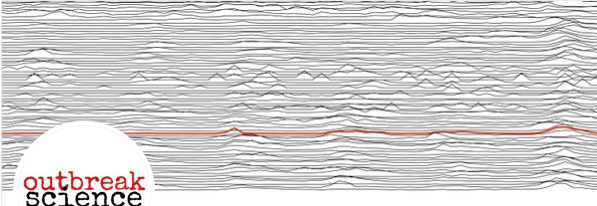

# In Vivo Imaging and Physiological Modelling - BMED 360 Spring 2020

# Ad hoc curriculum on COVID-19 and "outbreak science"
(work in progress)

#### We will keep substantial parts of the original curriculum (see [README](../README.md)), and extend those components that relates to "outbreak science", e.g. _the concept of modeling_, _diffusion_, _tracer kinetics_, _network science & graph theory_, _optimization_ ..., every topic supported by Jupyter notebooks (see below) - with programming exercises and challenges (see below)

## Course-related  material
  ### Book chapters
   - Selected chapters from Domingo WE. _Virus as Populations Composition, Complexity, Dynamics, and Biological Implications_. Academic Press, 2016. [[link](https://www.sciencedirect.com/book/9780128008379/virus-as-populations)]
  ### Papers
  
  ### Web sites
   - **WHO Coronavirus disease (COVID-19) Pandemic** (https://www.who.int/emergencies/diseases/novel-coronavirus-2019)
   - **Johns Hopkins University CORONAVIRUS RESOURCE CENTER** (https://coronavirus.jhu.edu) see also https://github.com/CSSEGISandData/COVID-19
  
  ### Data and challenges (for educational use)
   - **Fighting Covid-19 Challenge** Medical imaging is potentially well suited for Covid-19 diagnosis. "This challenge is about connecting the best brains to support doctors with artificial intelligence systems" (https://www.covid19challenge.eu)
   - **#Hack the Crisis Norway** A 48-hour challenge March 27th–29th (https://www.hackthecrisisnorway.com) see also [EU-Startups](https://www.eu-startups.com/2020/03/apply-by-midnight-tonight-to-join-the-online-covid-19-hackathon-run-by-the-norweigan-tech-community)
   - **COVID-19 Open Research Dataset Challenge (CORD-19)** An AI challenge with AI2, CZI, MSR, Georgetown, NIH & The White House (https://www.kaggle.com/allen-institute-for-ai/CORD-19-research-challenge)

## Online slides (some with video)

 - [In progress]

## Computer labs (on GitHub)
 - biology ([bio](./bio/README_bio.md))
 - epidemiology ([epi](./epi/README_epi.md))
 - spatio-temporal geographical information / cartography ([geo](./geo/README_geo.md))
 - imaging ([img](./img/README_img.md))
